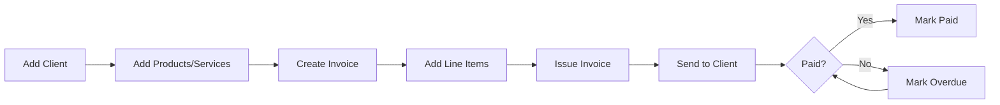
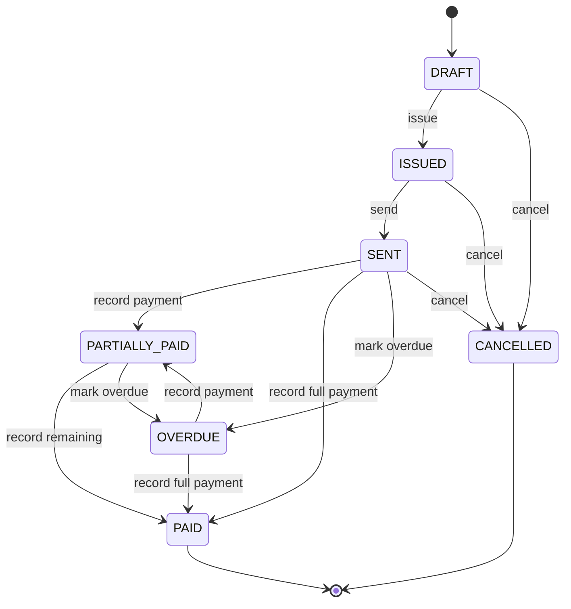
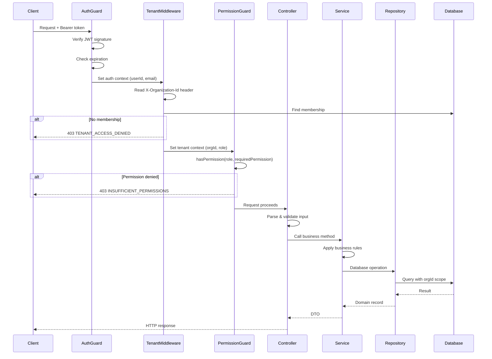
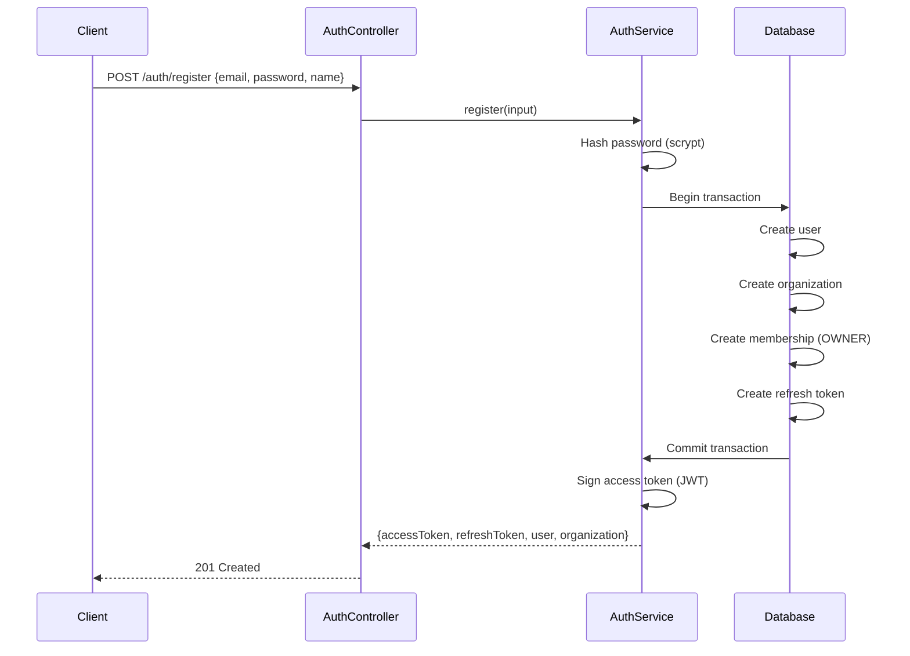
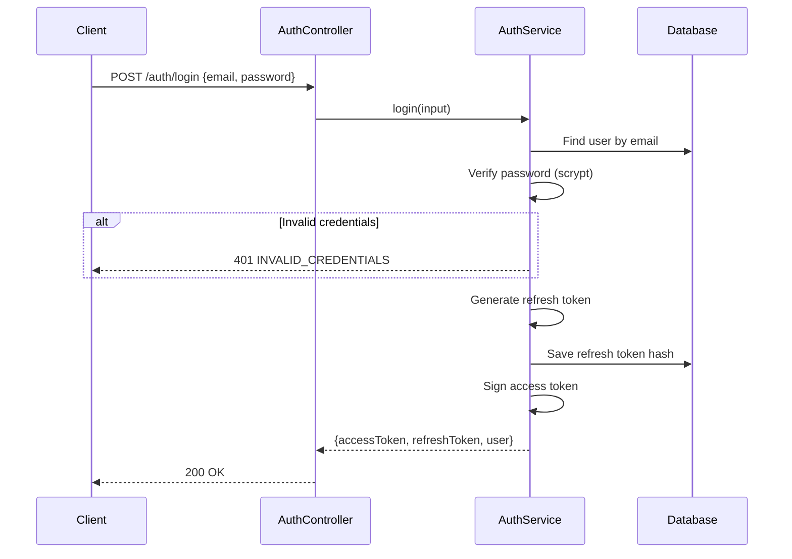
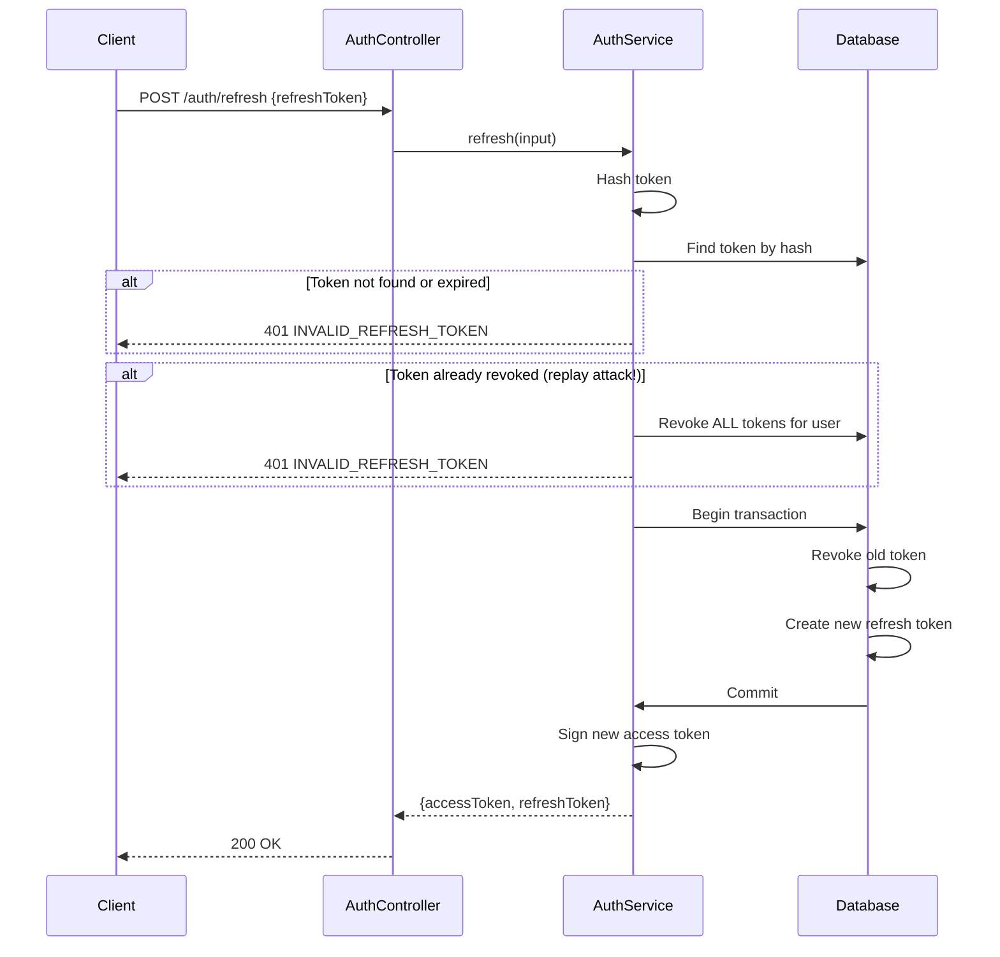
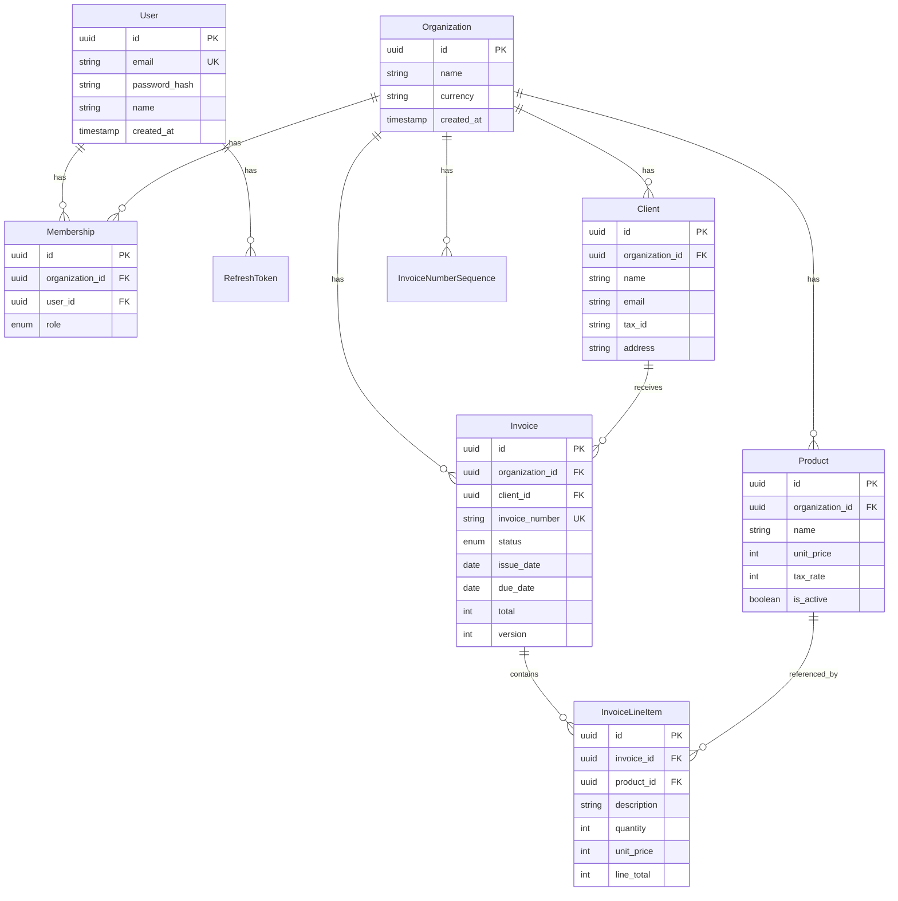

# Invocore

Multi-tenant invoicing SaaS. **Built end-to-end by one person** — the API, the frontend, the schema design, and the decisions behind all of it.

---

## What is Invocore?

Invocore is invoicing software for freelancers, agencies, and small businesses.

**The problem it solves:** You've finished work for a client. Now you need to send a professional invoice, track whether they paid, and keep records for taxes. Spreadsheets get messy. Emailing PDFs loses track of what's paid. Existing tools charge $20+/month for basic features.

**What Invocore does:**
- **Manage clients** — Store client details, addresses, and tax IDs in one place
- **Build a product catalog** — Define your services with pricing so invoices are consistent
- **Create and send invoices** — Add line items, set due dates, generate PDF invoices
- **Track payment status** — See what's draft, sent, paid, or overdue at a glance
- **Team access** — Invite accountants or staff with role-based permissions (Owner, Admin, Accountant, Viewer)
- **Multi-organization** — Consultants with multiple businesses can switch between them

**User flow:**



**Invoice lifecycle:**



---

## Contents

1. [The big picture](#the-big-picture)
2. [How requests flow through the system](#how-requests-flow-through-the-system)
3. [Layered architecture](#layered-architecture)
4. [Authentication flow](#authentication-flow)
5. [Error handling](#error-handling)
6. [Tech stack](#tech-stack)
7. [Repo layout](#repo-layout)
8. [The problems I actually had to solve](#the-problems-i-actually-had-to-solve)
9. [A flow, traced end to end](#a-flow-traced-end-to-end)
10. [Database schema](#database-schema)
11. [Running it](#running-it)

---

## The big picture

It's a pnpm monorepo. The backend is Express + TypeScript, the frontend is Next.js 16, and everything shares types through workspace packages.

```
┌─────────────────────────────────────────────────────────────────┐
│                         Browser                                  │
│                    Next.js 16 + React 19                        │
└─────────────────────────────────────────────────────────────────┘
                               │
                               ▼
┌─────────────────────────────────────────────────────────────────┐
│                        core-api                                  │
│            Express 5 · JWT Auth · Tenant Middleware             │
├─────────────────────────────────────────────────────────────────┤
│  auth        │  clients   │  products   │  invoices             │
│  users       │  orgs      │  members    │  sessions             │
└─────────────────────────────────────────────────────────────────┘
                               │
                               ▼
┌─────────────────────────────────────────────────────────────────┐
│                    PostgreSQL + Prisma                          │
│              Schema-isolated multi-tenancy                      │
└─────────────────────────────────────────────────────────────────┘
```

The one decision I'd point to first: **every tenant-scoped request requires an `X-Organization-Id` header**, and middleware validates the user's membership before any controller runs. This means tenant isolation isn't something controllers have to remember — it's enforced at the boundary.

---

## How requests flow through the system

Every authenticated request passes through the same middleware chain before reaching business logic:



**Key points:**
- Auth context and tenant context are **separate concerns** — you can be authenticated but not have access to a specific org
- Every database query includes `organizationId` from validated context, never from user input
- Permission checks happen before any business logic runs
- Controllers never access the database directly

---

## Layered architecture

Every feature follows the same structure. Here's the clients module as an example:

```
modules/clients/
├── clients.module.ts       # Wires dependencies, applies middleware
├── clients.controller.ts   # HTTP layer: parse input, call service, shape response
├── clients.service.ts      # Business logic: validation, orchestration
├── clients.repository.ts   # Data access: Prisma queries
└── dto/
    ├── clients.dto.ts      # Type definitions for request/response
    └── clients.validation.ts  # Input parsing and validation
```

### Module — Dependency wiring

The module is the composition root. It creates dependencies and wires them together:

```typescript
// clients.module.ts
export function createClientsModule(client: PrismaClient = prisma): Router {
  const router = createRouter();
  
  // Create dependencies
  const membershipsRepository = createMembershipsRepository(client);
  const clientsRepository = createClientsRepository(client);
  const clientsService = createClientsService(clientsRepository);

  // Apply middleware chain
  router.use(createAuthGuard(), createTenantMiddleware({ membershipsRepository }));
  
  // Mount controller
  router.use(createClientsController(clientsService));

  return router;
}
```

**Why factory functions instead of classes?**
- No `this` binding issues
- Easier to test (just pass mock dependencies)
- No decorator magic or reflection
- Dependencies are explicit in function signatures

### Controller — HTTP boundary

Controllers do three things: parse input, call the service, shape the response. No business logic:

```typescript
// clients.controller.ts
router.post(
  "/",
  createPermissionGuard("clients:write"),  // Permission check
  asyncController(async (request: Request, response: Response) => {
    const tenant = getTenantContext(request);  // Get validated org context
    
    const client = await clientsService.createClient({
      data: parseCreateClientRequest(request.body),  // Validate input
      organizationId: tenant.organizationId
    });

    response.status(201).json({ client });  // Shape response
  })
);
```

**What controllers DON'T do:**
- Access the database
- Contain business rules
- Know about Prisma or SQL
- Handle transactions

### Service — Business logic

Services own the business rules. They don't know about HTTP or databases:

```typescript
// clients.service.ts
export function createClientsService(clientsRepository: ClientsRepository): ClientsService {
  return {
    async createClient(input) {
      // Could add business validation here
      const record = await clientsRepository.create({
        data: input.data,
        organizationId: input.organizationId
      });

      return toClientDto(record);  // Transform to API shape
    },

    async getClient(input) {
      const record = await clientsRepository.findById({
        id: input.clientId,
        organizationId: input.organizationId
      });
      
      if (!record) {
        throw new AppError("Client not found", "CLIENT_NOT_FOUND", 404);
      }

      return toClientDto(record);
    }
  };
}
```

**What services own:**
- Business validation ("can this invoice be issued?")
- Domain errors ("client not found")
- Orchestration (calling multiple repositories)
- DTO transformation

### Repository — Data access

Repositories are the only layer that knows about Prisma. They return domain records, not Prisma types:

```typescript
// clients.repository.ts
export function createClientsRepository(client: CoreDbClient): ClientsRepository {
  return {
    async findById(input) {
      return client.client.findFirst({
        select: clientSelect,
        where: {
          id: input.id,
          organizationId: input.organizationId  // Always scoped to tenant
        }
      });
    },

    async list(input) {
      const where = buildWhere(input.organizationId, input.search);

      const [records, total] = await Promise.all([
        client.client.findMany({
          orderBy: { createdAt: "desc" },
          select: clientSelect,
          skip: input.offset,
          take: input.limit,
          where
        }),
        client.client.count({ where })
      ]);

      return { records, total };
    }
  };
}
```

**Key patterns:**
- Always include `organizationId` in WHERE clauses
- Use explicit `select` to avoid over-fetching
- Parallel queries with `Promise.all` for list + count
- Return `null` for not-found, let service decide the error

---

## Authentication flow

### Registration



### Login



### Token refresh with rotation



**Security properties:**
- Refresh tokens are stored as hashes, never plaintext
- Every refresh rotates the token (old one becomes invalid)
- Replaying a revoked token = account compromise → revoke all sessions
- Access tokens are short-lived (15 min), refresh tokens are long-lived (7 days)

---

## Error handling

### Structured error responses

Every error returns the same shape:

```typescript
// Response structure
{
  "error": {
    "code": "CLIENT_NOT_FOUND",    // Machine-readable
    "message": "Client not found"   // Human-readable
  }
}
```

### AppError — Domain errors

Business logic throws `AppError` with a code and HTTP status:

```typescript
// packages/shared/src/index.ts
export class AppError extends Error {
  constructor(
    message: string,
    public readonly code: string,
    public readonly statusCode: number
  ) {
    super(message);
  }
}

// Usage
throw new AppError("Client not found", "CLIENT_NOT_FOUND", 404);
throw new AppError("Cannot issue an invoice with status PAID", "INVALID_STATUS_TRANSITION", 409);
throw new AppError("You do not have permission", "INSUFFICIENT_PERMISSIONS", 403);
```

### Centralized error handler

One error handler at the app level converts errors to HTTP responses:

```typescript
// http-error.ts
export function sendHttpError(response: Response, error: unknown): void {
  // Domain errors → structured response
  if (error instanceof AppError) {
    response.status(error.statusCode).json({
      error: { code: error.code, message: error.message }
    });
    return;
  }

  // Prisma unique constraint → friendly message
  if (error instanceof Prisma.PrismaClientKnownRequestError && error.code === "P2002") {
    if (isEmailUniqueViolation(error)) {
      response.status(409).json({
        error: { code: "EMAIL_ALREADY_REGISTERED", message: "Email is already registered" }
      });
      return;
    }
  }

  // Unknown errors → generic 500 (don't leak internals)
  response.status(500).json({
    error: { code: "INTERNAL_SERVER_ERROR", message: "Unexpected server error" }
  });
}
```

### Error codes by category

| Code | Status | Meaning |
|------|--------|---------|
| `UNAUTHORIZED` | 401 | Missing or invalid auth token |
| `TOKEN_EXPIRED` | 401 | Access token has expired |
| `INVALID_CREDENTIALS` | 401 | Wrong email/password |
| `INVALID_REFRESH_TOKEN` | 401 | Refresh token invalid or revoked |
| `TENANT_ACCESS_DENIED` | 403 | User not a member of this org |
| `INSUFFICIENT_PERMISSIONS` | 403 | Role doesn't have required permission |
| `CLIENT_NOT_FOUND` | 404 | Resource doesn't exist |
| `INVOICE_NOT_FOUND` | 404 | Resource doesn't exist |
| `EMAIL_ALREADY_REGISTERED` | 409 | Unique constraint violation |
| `INVALID_STATUS_TRANSITION` | 409 | State machine rejected the action |
| `VERSION_CONFLICT` | 409 | Optimistic lock failed |
| `INVOICE_NOT_EDITABLE` | 409 | Can only edit drafts |

---

## Tech stack

| Layer | What I used |
|-------|-------------|
| Frontend | Next.js 16, React 19, Tailwind 4, shadcn/ui |
| Backend | Express 5, TypeScript 5.9, Node 22 |
| Database | PostgreSQL with Prisma ORM |
| Auth | Hand-rolled JWT (HS256), refresh token rotation |
| Monorepo | pnpm workspaces with `workspace:*` protocol |

---

## Repo layout

```
invocore/
├── apps/
│   ├── core-api/           # REST API — auth, invoices, clients, products
│   ├── web/                # Next.js frontend
│   ├── payments-service/   # Payment processing (planned)
│   └── workers-service/    # Background jobs — PDF rendering
└── packages/
    ├── database/           # Prisma schema + generated client
    ├── config/             # Shared configuration + tsconfigs
    └── shared/             # Common types, AppError, utilities
```

---

## The problems I actually had to solve

This is the part that separates a demo from real software.

### Not leaking data across tenants

The original pain was scattered `WHERE organization_id = ?` checks. One missed check means one tenant sees another's data.

The fix: middleware that runs before every tenant-scoped route. It reads `X-Organization-Id`, validates the user is a member, and injects `organizationId` into request context. Controllers never touch the header directly.

```typescript
// tenant.middleware.ts
const membership = await membershipsRepository.findByOrganizationAndUser({
  organizationId,
  userId: auth.userId
});
if (!membership) {
  throw new AppError("You do not have access to this organization", "TENANT_ACCESS_DENIED", 403);
}
setTenantContext(request, { organizationId, role: membership.role });
```

Every downstream query uses `organizationId` from validated context, not user input.

---

### Role-Based Access Control (RBAC) that scales

The original approach was `if (role === 'ADMIN' || role === 'OWNER')` scattered through the codebase. Adding a new role meant hunting through every file. Permissions were implicit, buried in conditionals.

**The fix:** A declarative permission system with three components:

#### 1. Permission strings

Every action in the system is expressed as `resource:action`:

```typescript
// permissions.ts
export type Permission =
  | "clients:read" | "clients:write" | "clients:delete"
  | "products:read" | "products:write" | "products:delete"
  | "invoices:read" | "invoices:write" | "invoices:delete" | "invoices:approve" | "invoices:send"
  | "members:read" | "members:invite" | "members:remove" | "members:change-role"
  | "reports:read"
  | "org:settings";
```

#### 2. Single policy table

Every role maps to a list of permissions. OWNER gets a wildcard that grants everything — current and future permissions:

```typescript
const WILDCARD = "*" as const;

export const ROLE_PERMISSIONS: Record<Role, Permission[] | [Wildcard]> = {
  OWNER: [WILDCARD],  // Full access, no enumeration needed

  ADMIN: [
    "clients:read", "clients:write", "clients:delete",
    "products:read", "products:write", "products:delete",
    "members:read", "members:invite", "members:remove", "members:change-role",
    "invoices:read", "invoices:write", "invoices:delete", "invoices:approve", "invoices:send",
    "reports:read", "org:settings"
  ],

  ACCOUNTANT: [
    "clients:read", "clients:write",
    "products:read", "products:write",
    "invoices:read", "invoices:write",
    "reports:read"
  ],

  VIEWER: ["clients:read", "products:read", "invoices:read", "reports:read"]
};
```

#### 3. Single enforcement function

Guards and services call one function. No special-casing:

```typescript
export function hasPermission(role: Role, permission: Permission): boolean {
  const grants = ROLE_PERMISSIONS[role];
  if (grants[0] === WILDCARD) return true;  // OWNER bypass
  return (grants as Permission[]).includes(permission);
}
```

#### 4. Guard factory

Controllers wire up permissions declaratively. No permission logic in business code:

```typescript
// role.guard.ts
export function createPermissionGuard(permission: Permission): RequestHandler {
  return (request, _response, next) => {
    const { role } = getTenantContext(request);  // Injected by tenant middleware

    if (!hasPermission(role, permission)) {
      throw new AppError("You do not have permission to perform this action", "INSUFFICIENT_PERMISSIONS", 403);
    }
    next();
  };
}

// Usage in controller
router.post("/", authGuard, tenantMiddleware, createPermissionGuard("clients:write"), createClient);
router.delete("/:id", authGuard, tenantMiddleware, createPermissionGuard("clients:delete"), deleteClient);
```

**Why this design:**
- Adding a new role = one entry in `ROLE_PERMISSIONS`
- Adding a new permission = one string in the union type + one entry per role that needs it
- No scattered conditionals to update
- OWNER automatically gets new permissions (wildcard)
- Guards are composable and declarative
- Permission matrix is auditable in one place

---

### Stolen refresh tokens becoming useless

The problem: if someone steals a refresh token, they have access until it expires — which could be days.

The fix: refresh token rotation with replay detection. Every refresh issues a new token and revokes the old one. If someone replays an already-rotated token, that signals theft — so we revoke every active session for that user.

```typescript
// auth.service.ts
if (existing.revokedAt) {
  // Replaying an already-rotated token signals theft
  await authRepository.revokeAllForUser(existing.userId);
  throw new AppError("Invalid refresh token", "INVALID_REFRESH_TOKEN", 401);
}
```

Even if an attacker captures a token, using it after the legitimate user has refreshed triggers automatic lockout.

---

### Invoice status changes that don't break accounting

The problem: ad-hoc status updates lead to invalid states. A cancelled invoice shouldn't become paid. A paid invoice shouldn't become a draft.

The fix: a state machine. Valid transitions are encoded in a table. Invalid transitions throw immediately.

```typescript
// invoice-transitions.ts
const TRANSITIONS: Record<InvoiceStatus, Partial<Record<Action, InvoiceStatus | InvoiceStatus[]>>> = {
  DRAFT: { issue: ISSUED, cancel: CANCELLED },
  ISSUED: { markSent: SENT, cancel: CANCELLED },
  SENT: { recordPayment: [PARTIALLY_PAID, PAID], markOverdue: OVERDUE, cancel: CANCELLED },
  PARTIALLY_PAID: { recordPayment: [PARTIALLY_PAID, PAID], markOverdue: OVERDUE },
  OVERDUE: { recordPayment: [PARTIALLY_PAID, PAID] },
  PAID: {},
  CANCELLED: {}
};
```

Adding a new status means updating one table, not hunting through business logic.

---

### Concurrent edits clobbering each other

The problem: two users open the same invoice, both edit, last save wins silently.

The fix: optimistic locking via a `version` column. Every update requires the expected version. If it doesn't match, the update fails with a clear error.

```typescript
// invoices.service.ts
const record = await invoicesRepository.updateDraft({
  id: input.invoiceId,
  organizationId: input.organizationId,
  expectedVersion: input.expectedVersion,  // Must match current version
  data: updateData
});

if (!record) {
  throw new AppError(
    "Invoice was modified by another user. Please refresh and try again.",
    "VERSION_CONFLICT",
    409
  );
}
```

---

### Invoice numbers that don't collide

The problem: generating `INV-2026-00001` with application-level logic risks duplicates under concurrent requests.

The fix: atomic increment at the database level. A sequence table per organization per year. The increment happens in the same transaction as the invoice update.

```typescript
// invoice-number.service.ts
const updated = await client.invoiceNumberSequence.update({
  data: { lastNumber: { increment: 1 } },
  where: { organizationId_year: { organizationId, year } }
});
return `INV-${year}-${String(updated.lastNumber).padStart(5, "0")}`;
```

No application-level locking. Sequences reset yearly for clean accounting periods.

---

### No external auth dependencies

I didn't want to debug Passport.js middleware or pay for Auth0. JWT verification is 50 lines with `crypto`:

```typescript
// token.service.ts
const expectedSignature = createHmac("sha256", config.auth.jwtSecret)
  .update(`${encodedHeader}.${encodedPayload}`)
  .digest();

if (!timingSafeEqual(expectedSignature, providedSignature)) {
  throw new AppError("Invalid access token", "INVALID_TOKEN", 401);
}
```

`timingSafeEqual` prevents timing attacks. Full control over token lifecycle.

---

## A flow, traced end to end

### Issuing an invoice (state machine + transaction + number generation)

1. Frontend calls `POST /invoices/:id/issue` with the current version
2. Auth guard validates JWT, extracts user
3. Tenant middleware validates `X-Organization-Id`, confirms membership, injects role
4. Role guard checks `hasPermission(role, "invoices:write")`
5. Service fetches invoice, checks current status is DRAFT
6. State machine validates `issue` action is legal from DRAFT
7. Transaction starts:
   - Invoice number service atomically increments sequence for org + year
   - Invoice updates to ISSUED status with generated number
   - Version increments
8. Transaction commits, response returns

If step 5 fails (wrong status), 409. If step 6 fails (invalid transition), 409. If version doesn't match, 409. Every failure mode has a specific error code.

---

## Database schema

### Entity relationship diagram



### Tables and purpose

| Table | Purpose | Key indexes |
|-------|---------|-------------|
| `users` | Authentication identity | `email` (unique) |
| `organizations` | Tenant boundary | — |
| `organization_members` | User ↔ Organization with role | `(org_id, user_id)` unique, `user_id` |
| `clients` | Billable customers per tenant | `org_id`, `(org_id, name)` |
| `products` | Catalog items with pricing | `org_id`, `(org_id, name)` |
| `invoices` | Header with status, dates, totals | `org_id`, `(org_id, status)`, `(org_id, client_id)`, `(org_id, invoice_number)` unique |
| `invoice_line_items` | Line-level detail | `invoice_id` |
| `invoice_number_sequences` | Per-org per-year counters | `(org_id, year)` unique |
| `refresh_tokens` | Rotatable session tokens | `token_hash` unique, `user_id`, `expires_at` |
| `audit_logs` | Action tracking | `org_id`, `user_id`, `(resource, resource_id)` |

### Indexing strategy

```prisma
// Every tenant-scoped query filters by organization_id first
model Client {
  @@index([organizationId])              // Fast org filtering
  @@index([organizationId, name])        // Fast search within org
}

model Invoice {
  @@index([organizationId])              // Fast org filtering
  @@index([organizationId, status])      // Filter by status
  @@index([organizationId, clientId])    // Filter by client
  @@unique([organizationId, invoiceNumber])  // Unique within org
}
```

### Money as integers

All monetary values are stored as **integers in the smallest currency unit** (cents for USD):

```typescript
// $150.00 is stored as 15000
// $49.99 is stored as 4999

// Tax rate is basis points (1/100th of a percent)
// 18% tax = 1800 basis points
const taxRate = 1800;
const lineTotal = quantity * unitPrice;
const lineTax = Math.round((lineTotal * taxRate) / 10_000);
```

**Why integers?**
- No floating point precision issues ($0.1 + $0.2 ≠ $0.3 in floats)
- Exact arithmetic for financial calculations
- Database stores exactly what you put in
- Frontend formats for display: `(cents / 100).toFixed(2)`

---

## Running it

```bash
pnpm install
cp .env.example .env  # Configure DATABASE_URL, JWT_SECRET
pnpm dev              # Starts all apps in parallel
```

---

## What's next

- **payments-service** — Stripe integration with webhook signature verification
- **workers-service** — Email sending, reminders, and overdue jobs
- **PDF generation** — Runs through BullMQ, retries transient failures, and stores local development files outside the web request path
- **Audit log queries** — Expose audit trail through API

---

Built by one person, end to end — the code, the schema, and the decisions behind both.
